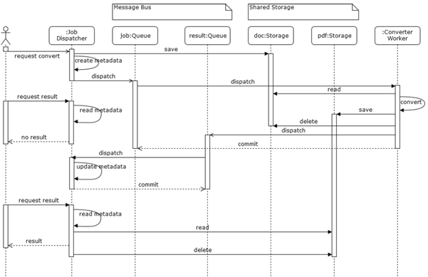
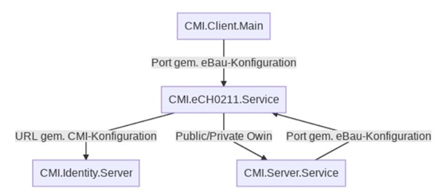

**Dokumentationsanleitung und Hilfestellung**

[Komponentenfreigabe Wiki]

# Offizielle Bezeichnung (eindeutig, treffend, einheitlich verwendet)
> Kurze Beschreibung der Komponente

## Inhaltsverzeichnis
* [Allgemeine Informationen](#allgemeines)
* [Technische Informationen](#technisches)
* [Installation & Konfiguration](#installation)
* [Troubleshooting / Mögliche Fehlerquellen](#troubleshooting)

## Allgemeines
* Status: In Entwicklung / Freigegeben / Wird nicht weiterentwickelt
* Fachliche Ansprechperson: (z.B. Produktmanager)
* Technische Ansprechperson: (z.B. Hauptentwickler)
* Nur für speziellen Kunde: nein / ja, und zwar ...

### Aufgabe
(Siehe [Komponentenfreigabe Wiki] für Beispiele)

### Strategische_Einordnung
(z.B. ersetzt langfristig X, sollabgelöst werden von Y, Speziallösung für Kunde XY, ...)

## Technisches
Technische Informationen zu der Komponente.

### Eigenschaften
Die Komponente erfüllt folgende Eigenschaften:

(falls ja, bitte Beschreibung wie/unter welchem Umständen/mit welcher Konfiguration)

* Stateless: nein / ja, wenn ...
* Skalierbar/Multiinstanzfähig: nein / ja, mit Konfiguration ...
* Mehrmandantenfähig: nein / ja, über ...
* Proxyfähig: nein / ja, weil ...
* Laufzeitverhalten (z.B. ein durchgängig laufender Service, ein Batch-Job, Aktivierung durch Trigger, o.ä.)

Sonstiges:
(z.B. Wichtige/Kundenspezifische Informationen)

### Abhängigkeiten
Folgende Services verwendet die Komponente:

| Service       | Version   | Anbindung  | Protokoll | Standardports | Verfügbarkeit | Fehlertoleranzklasse   |
| ------------- | --------- | ---------- | --------- | ------------- | ------------- | ---------------------- |
| DB-Service    | 10.4      | persistent | tcp       | 5432          | muss / start  | Absturz                |
| Service Int   | >= V20.0  | on request | http/s    | 10003,10004   | muss          | Reconnect              |
| Service Ext   | 1.0.1     | on start   | http/s    | 80/443        | kann          | Funktionseinschränkung |

#### Fehlertoleranz
Wie verhält sich die Komponente, wenn der Service nicht verfügbar ist?
Grundsätzlich sollte eine Komponente so unabhängig wie möglich mit externen Services umgehen.
Mögliche Werte wären hierbei: "Absturz", "Reconnect", "Funktionseinschränkung"

### Sequenzdiagramm 
Komplexe Kommunikationswege einfach aufzuzeigen (falls sie für das Verständnis notwendig sind):

### Komponentendiagramm 
 Komplexe Abhängigkeiten einfach aufzuzeigen (falls sie für das Verständnis notwendig sind):

### Technologiestack
Folgende Technologien werden eingesetzt:
* ASP.NET Core 3.1
* Angular 8
* Node.js 12
* ...

## Installation
Informationen zur Installation der Komponente.

### Systemvoraussetzungen
Folgende Komponenten müssen auf dem System installiert/vorhanden sein:
* ASP.NET Core 3.1 Runtime
* IIS Feature Rewrite Module
* ...

### Installationsanleitung
[Vollständige Anleitung zur Installation der Komponente inklusive benötigter Services.](./docs/Installation.md)

### Entwicklerhinweise
Hinweise zur Einrichtung der Entwicklungsumgebung und Debug-Builds.

### Konfigurationsmöglichkeiten
Folgende Konfigurationen sind möglich und können in der Konfigurationsdatei xy.config oder über Kommandozeilenparameter/Umgebungsvariablen gesetzt werden.

| Name       | Beschreibung                         | obligatorisch  | Standardwert | Erlaubte Werte
| ---------- | ------------------------------------ | -------------- | ------------ | -------------
| PGSQL_HOST | FQDN-Hostname für PostgreSQL-Server  | ja             | -            | URI
| Port       | Port auf den sich der Service bindet | nein           | 80           | 1025-65534         
| TEMPPATH   | Pfad für temporäre Dateien           | nein           | ./tmp/       | Existierende Pfadangabe
| Debug      | Debug-Modus ein/ausschalten          | nein           | false        | true/false       

Grundsätzlich sollten hier vor allem Umgebungskonfigurationen (Pfade, URLS/Ports, ConnectionStrings, ...) definiert werden. Fachliche Konfigurationen sollten innerhalb der Komponente vorgenommen werden können. Es sollte nur als obligatorisch definiert werden was zwingend notwend ist. Ansonsten sollen sinnvolle Standardwerte im Code gesetzt werden, die bei Bedarf über die Konfiguration überschrieben werden.

## Troubleshooting
Mögliche Fehlerquellen sind ...

[Komponentenfreigabe Wiki]: https://cminformatik.atlassian.net/wiki/spaces/CMIBetrieb/pages/1827700770/Komponentenfreigabe
